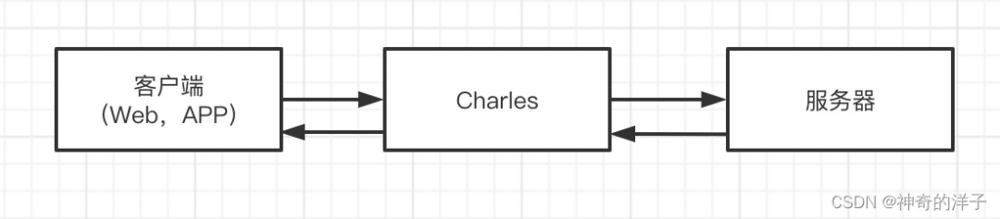

# Charles 学习笔记

[Charles 从入门到精通，看这篇文章就够了 (qq.com)](https://mp.weixin.qq.com/s?__biz=MzAwMjE0Mzg0Nw==&mid=2650674015&idx=1&sn=9683e9234a894c2416eeecc84b0a69c4&chksm=82c45057b5b3d9410872b1a3930f2a8aa4abe7767e4c729464f81a49e15c1069dfa807432b5a&token=1002072809&lang=zh_CN#rd)

1. 概念

   代理服务器，中间人，

   

   可以捕获客户端到服务端的请求，捕获服务端传回客户端的响应，

- 配置Charles为系统代理（pc可以捕获HTTP）
- 配置客户端代理服务器为Charlesip和端口8888，安装证书

2. 常用功能
   - 重复请求：repeat，可以配置重发次数，并发
   
   - 模拟弱网：“Proxy”->”Throttle Setting” 
   
   - 修改请求或响应:
   
     1. MAP: 长期地将某一些请求重定向到另一个网络地址或本地文件
   
        - MAP remote: 将指定的网络**请求**重定向到另一个网址请求地址
   
          例如将百度重定向至google
   
          址
   
        - MAP Local：将**响应**的内容重定向到本地文件
   
     2. Rewrite：修改请求或者返回结果Body或者Header内容，支持正则表达式
   
     3. BreakPoints: 临时修改网络请求的请求/返回内容
   
     4. 反向代理：将本机端口映射到远程端口。这样访问本机端口，会由远程端口返回。

