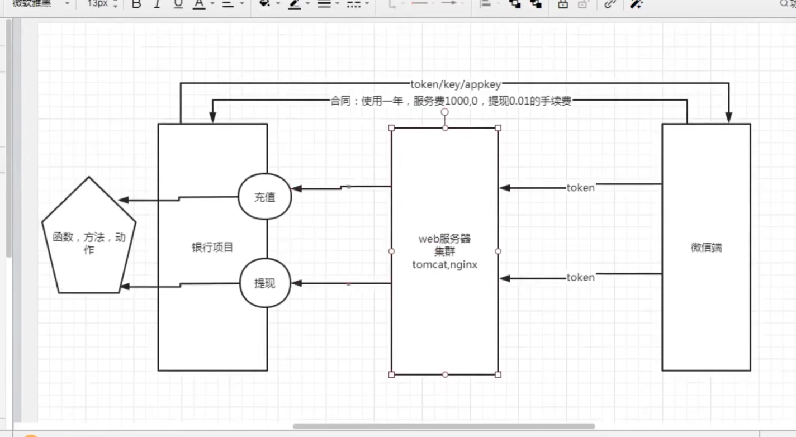

# Postman学习笔记

## 1. 接口：API(Application Programming interface)

- 做数据传输，软件提供给外部的服务
- 让内部的数据从外部进行修改

需要鉴权码（token，key，appkey）

内部接口：开发人员自己开发的对自身系统提供的接口

外部接口：开发系统调用外部

+ 接口测试的必要性

  前后端进度不一样时，两边可以用mock模拟

+ 安全考虑

  前端验证容易绕过，直接请求接口

## 2. 接口测试本质

测试接口能否正常**交互数据，权限控制以及异常场景**

## 3. 接口数据格式

- ### json(这个多一些)

  1. 三组数据：{error_code:0, msg:"提现成功", data:[]}
  2. json：数据类型，整型，小数，字符串
  3. json由两组数据组成：Map对象，键值对 {key:value, key: value}
  4. 数组：{value1, value2, value3}

​	

- html

  <html>

  ...

  <html>

- xml

  <?xml?version="1.0" encoding="utf8">

  ​	<error_code>0<error_code>

  </xml>

## 4. 接口测试协议

### 4.1 webservice

1. 接口地址：http://........?wsdl

2. restful规则：get获取数据，post提交数据，delete修改数据

​	eg. http://192.168.12.1:8080/user

### 4.2 dubbo

dubbo://...

适用于少量数据的传输，大并发

### 4.3 http

- 超文本传输协议，用于浏览器和服务器之前交互数据：
  - 请求request：get, post, delete
  - 响应response：1xx信息，2xx成功，3xx重定向(跳转不传值)，4xx客户端错误，5xx服务器错误

https=http+ssl port:443

http port 80

#### 4.3.1 request（4个部分）

- 请求行，请求方式，请求地址，协议

​	```GET /s?ie=utf-8&wd=get&rsv_sug7=100 HTTP/1.1```

- 请求头

  - Host：请求的主机地址

  - Connection：保持活跃(keep-alive)

  - Accept: 客户端可以接受的数据格式

   -   **X-Requested-With**：异步请求

   -  **User-Agent**：客户端代理

   -  Accept-Encoding：压缩方式

   -  Cookie：Cookie信息

      

````html
Host: www.baidu.com
Connection: keep-alive
Accept: */*   
is_xhr: 1
X-Requested-With: XMLHttpRequest
is_referer: https://www.baidu.com/s?ie=utf-8&f=3&rsv_bp=1&rsv_sug4=6997
User-Agent: Mozilla/5.0 (Windows NT 10.0; Win64; x64) AppleWebKit/537.36 (KHTML, like Gecko) Chrome/80.0.3987.163 Safari/537.36
Sec-Fetch-Site: same-origin
Sec-Fetch-Mode: cors
Referer: https://www.baidu.com/s?ie=utf-8&f=8&rsv_bp=1&rsv_sug7=000&bs=get%E8%AF%B7%E6%B1%82%E6%9C%89%E8%AF%B7%E6%B1%82%E4%BD%93%E5%90%97
Accept-Encoding: gzip, deflate, br
Accept-Language: zh-CN,zh;q=0.9
Cookie: BIDUPSID=8C6D6577D7C; WWW_ST=1594881925661

```
````

- 空一行
- 请求正文


#### 4.3.2 response（4个部分）

- 响应行
- 响应头
- 空一行
- 响应内容


## 5. 企业接口测试流程方案

1. 拿到api接口文档，熟悉接口业务，接口地址，入参，出参，鉴权，错误码
2. 计划和方案：
   - 正例：正确的入参，查看接口是否返回成功
   - 反例：
     - 鉴权反例：鉴权值为空、鉴权码错误、鉴权码过期
     - 参数反例：参数为空、类型异常、长度异常、错误码覆盖
     - 其他：分页异常
3. 编写用例和评审
4. 执行接口测试
5. 输出接口测试报告


## 6. 接口关联

- 使用json提取器实现

  ```js
  //第一个接口
  //get value of access_token
  //change the data with string format to object
  var result = JSON.parse(responseBody);
  //set access_token to global var
  pm.globals.set("access_token", result.access_token)
  
  //第二个接口
  {{access_token}}
  ```

  

- 使用正则表达式提取器实现

```js
//第一个接口
//match 匹配
//change the data with string format to object
var result = responseBody.match(new RegExp('"access_token":"(.*?)"'));
//set access_token to global var
pm.globals.set("access_token", result.[1])

//第二个接口
{{access_token}}
```

## 7. Postman内置动态参数以及自定义动态参数

- 内置动态参数
  - {{$timestamp}}: 当前时间戳
  - {{$randomInt}}: 生成0-1000随机数
  - {{$guid}}：生成随机GUID字符串